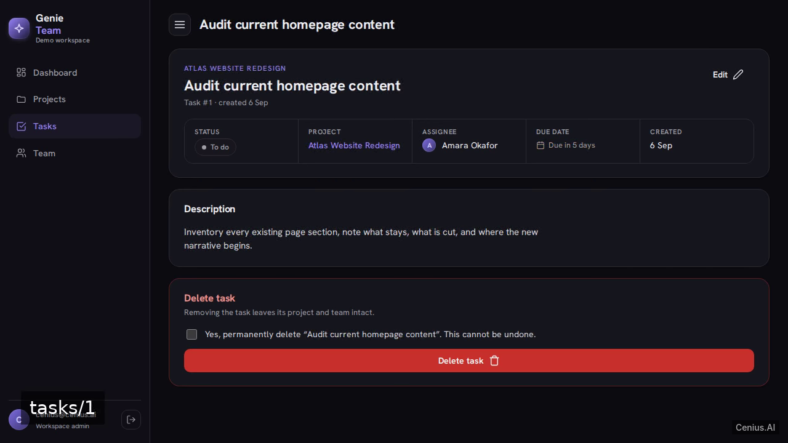
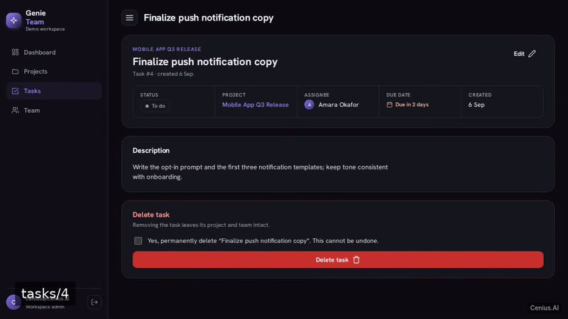
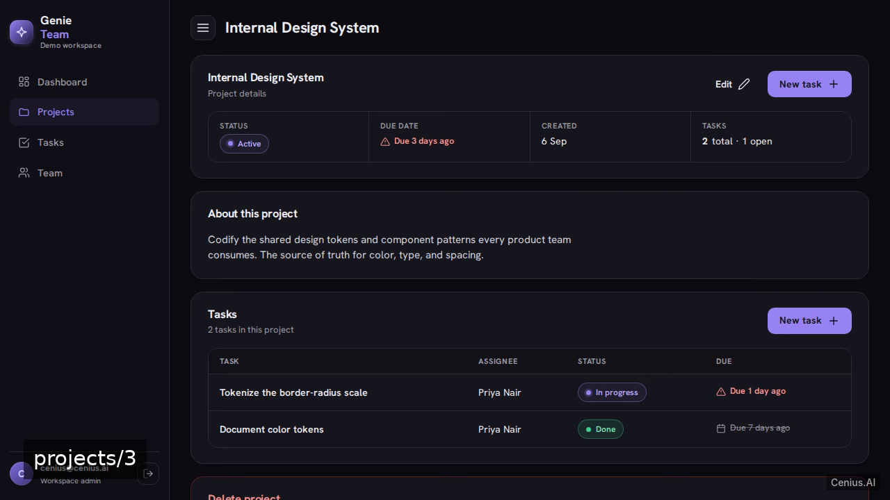
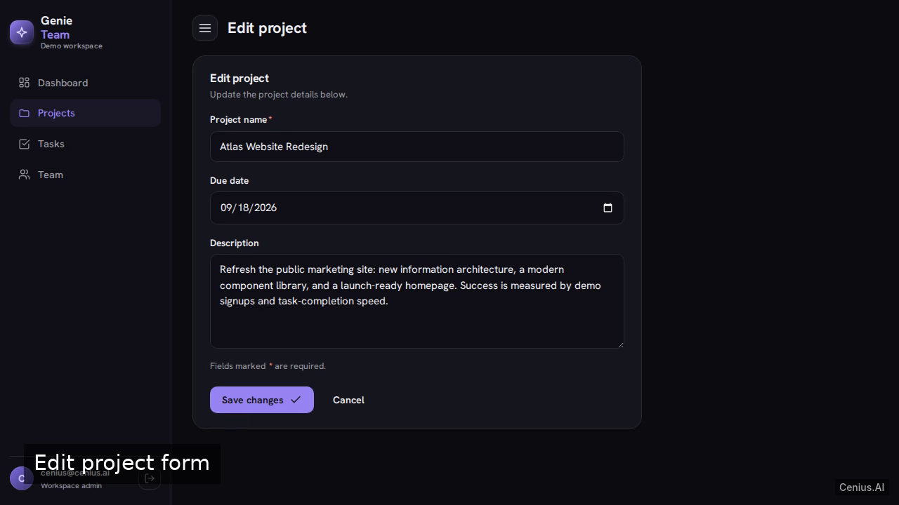

# GenieSprint — production-ready Julia monitoring dashboard starter

**GenieSprint** gives you two paths: self-host the Apache-2.0-licensed Julia source as your own monitoring dashboard, or [open it on cenius.ai](https://cenius.ai/marketplace/p/geniesprint?ref=gh&utm_campaign=geniesprint-julia), describe the changes you want, and receive a new GenieSprint build with full rebrand rights. GenieSprint is a clean-minimal project/task manager built with Julia + Genie.jl, real SQLite persistence, email/password auth, seeded demo data, a dashboard, and CRUD for projects, team members, and tasks. Everything ships in this repo — no paywall, no hidden features, no separate GenieSprint download.


[](LICENSE)  [](https://cenius.ai)

[](https://cenius.ai/marketplace/p/geniesprint?ref=gh&utm_campaign=geniesprint-julia)

> **▶ [Open & edit in cenius.ai](https://cenius.ai/marketplace/p/geniesprint?ref=gh&utm_campaign=geniesprint-julia)** — one click to an editable workspace: describe changes in plain English, get an instant preview, one-click deploy and host. Modifications made on the platform come with full rebrand & relicense rights.

_Local clone? See [Quick start](#quick-start) below. cenius.ai is the zero-setup path._

## Demo





▶ **[Video walkthrough](https://cenius.ai/marketplace/p/geniesprint?ref=gh&utm_campaign=geniesprint-julia)** — see the app in action on the cenius.ai project page · [MP4 file](.github/media/demo.mp4)

## Screenshots

  

## Architecture

A self-contained Julia project (54 files): top-level directories include `data/`, `db/`, `public/`, `src/`, `test/`. Dependency management and data seeding are both handled by `./install.sh` — run it once, then start the server. For environment-specific setup, see [`INSTALL.md`](INSTALL.md).

## Features

- Email/password authentication with demo admin
- Project CRUD
- Task CRUD
- Team member CRUD
- Dashboard
- Seeded demo workspace

## Quick start

```bash
./install.sh   # installs dependencies + seeds demo data
```

See [`INSTALL.md`](INSTALL.md) for full setup and usage instructions.

## Usage guide

Sign in at `/login` with the demo admin account shown on the card:
**cenius@cenius.ai / cenius**. (A second admin, `demo@example.com / password123`,
is seeded too.)

### The dashboard

After login you land on `/dashboard`:

- **KPI strip** — projects, open tasks, completed tasks (with % done), team members.
- **Projects** panel — every project by due date; click a row to open it.
- **Task status** panel — the todo / in-progress / done split.
- **Needs attention** — open tasks past their due date (red chips).
- **Upcoming** — open tasks due in the next 14 days.

`New task` and `New project` buttons are in the page header.

### Projects

- `/projects` — dense table of projects (name, due date, task count). Use **New
  project** or the header button.
- Project detail (`/projects/:id`) shows metadata and that project's tasks, with
  **Edit** and, when the project has no tasks, a **Delete** form that requires
  checking the confirmation box. Projects that still have tasks can't be deleted —
  the app explains why and points at the tasks.
- New/edit forms validate the required, workspace-unique name and optional due
  date; errors re-render the form with your input preserved.

### Tasks

_Full guide: [`USAGE.md`](USAGE.md)_

## FAQ

### How do I get GenieSprint running locally?

Everything you need ships in this repo: clone it, run `./install.sh` to install dependencies and seed demo data, then follow [`INSTALL.md`](INSTALL.md) to start it. No external services required.

### Can I rebrand or white-label GenieSprint?

Yes. The MIT license lets you remove the original branding and ship under your own name. For a guided approach, [remix it on cenius.ai](https://cenius.ai/marketplace/p/geniesprint?ref=gh&utm_campaign=geniesprint-julia): you get a fresh build with full rebrand and relicense rights.

### Which framework or language does GenieSprint use?

GenieSprint is a Julia application — and this repository holds the complete, runnable source, not a stripped-down sample. Highlights include seeded demo workspace.

### Can I change GenieSprint without writing code?

[cenius.ai](https://cenius.ai/marketplace/p/geniesprint?ref=gh&utm_campaign=geniesprint-julia) handles the implementation. Tell it what you want in everyday words, pick up the updated build. No coding needed.

### Is it OK to ship GenieSprint as part of a product?

The code is under the Apache-2.0 license, which allows commercial use without restriction. You can build, sell, and deploy it freely. Full text: [LICENSE](LICENSE).

## License & rebranding

Released under the [Apache License 2.0](LICENSE) (© 2026 Cenius AI) — free for personal and commercial use. The Cenius name/logo are trademarks (see NOTICE).

**Need a customized version?** [Remix this app on cenius.ai](https://cenius.ai/marketplace/p/geniesprint?ref=gh&utm_campaign=geniesprint-julia) — modifications made on the platform come with **full rebrand & relicense rights** over your derivative.

## Built with cenius.ai

This entire application — code, design, seeded demo data — was generated on **[cenius.ai](https://cenius.ai)** from a plain-English description.

- 🚀 [Build your own app on cenius.ai](https://cenius.ai)
- 🎛️ [Remix GenieSprint on the marketplace](https://cenius.ai/marketplace/p/geniesprint?ref=gh&utm_campaign=geniesprint-julia) — open it in a workspace, prompt for changes, and ship your own version.

More open-source apps: [the Cenius-ai catalog](https://github.com/Cenius-ai) · [showcase index](https://github.com/Cenius-ai/showcase)
